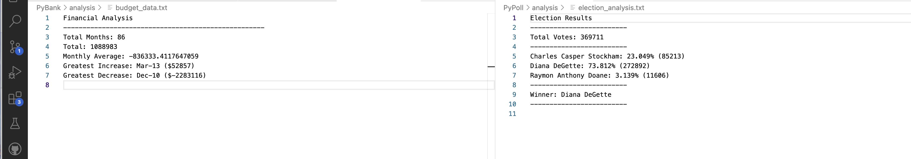

# Python Challenge

## Description
Created a Python script to analyze the financial records of your company

## Table of Contents
- [Installation](#installation)
- [Usage](#usage)
- [Credits](#credits)
- [License](#license)
- [Features](#features)
- [Tests](#tests)
- [Contact](#contact)

## Installation
python, csv library

## Usage
Run main.py file in PyPoll and PyBank directories

## Credits
Jennifer Harris

## License
MIT

## Features
Provides summary of election and budget data

## Tests
Confirm that the budget and poll files are created. confirm that the .txt file is recorded

## Contact
If there are any questions of concerns, I can be reached at:
##### [github: mrslinton](https://github.com/mrslinton)
##### [email: jennifer.v.harris@outlook.com](mailto:jennifer.v.harris@outlook.com)
